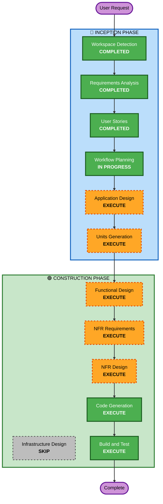

# Execution Plan

## Detailed Analysis Summary

### Change Impact Assessment
- **User-facing changes**: Yes - 새로운 채팅 웹 UI 구축
- **Structural changes**: Yes - 전체 시스템 신규 구축 (프론트엔드 + 백엔드 + Batch + DB)
- **Data model changes**: Yes - ChromaDB, KùzuDB, SQLite 스키마 신규 설계
- **API changes**: Yes - 백엔드 REST/WebSocket API 신규 설계
- **NFR impact**: Yes - 스트리밍 응답, 동시 사용자 처리, 하이브리드 검색 성능

### Risk Assessment
- **Risk Level**: Medium
- **Rollback Complexity**: Easy (Greenfield, 로컬 배포)
- **Testing Complexity**: Moderate (Vector + Graph + LLM 통합 테스트 필요)

---

## Workflow Visualization

### Mermaid Diagram



### Text Alternative

```
Phase 1: INCEPTION
  - Workspace Detection (COMPLETED)
  - Requirements Analysis (COMPLETED)
  - User Stories (COMPLETED)
  - Workflow Planning (IN PROGRESS)
  - Application Design (EXECUTE)
  - Units Generation (EXECUTE)

Phase 2: CONSTRUCTION (per-unit)
  - Functional Design (EXECUTE)
  - NFR Requirements (EXECUTE)
  - NFR Design (EXECUTE)
  - Infrastructure Design (SKIP)
  - Code Generation (EXECUTE)
  - Build and Test (EXECUTE)
```

---

## Phases to Execute

### 🔵 INCEPTION PHASE
- [x] Workspace Detection (COMPLETED)
- [x] Requirements Analysis (COMPLETED)
- [x] User Stories (COMPLETED)
- [x] Workflow Planning (IN PROGRESS)
- [ ] Application Design - EXECUTE
  - **Rationale**: 신규 프로젝트로 컴포넌트 식별, 서비스 레이어 설계, 컴포넌트 간 의존성 정의 필요. 프론트엔드/백엔드/Batch/DB 4개 주요 컴포넌트의 메서드와 비즈니스 규칙 정의 필요.
- [ ] Units Generation - EXECUTE
  - **Rationale**: 프론트엔드, 백엔드 API, RAG 검색 엔진, Batch 임베딩 등 독립적으로 개발 가능한 단위로 분해 필요. 다중 컴포넌트 시스템이므로 구조화된 단위 분해가 효율적.

### 🟢 CONSTRUCTION PHASE (per-unit)
- [ ] Functional Design - EXECUTE
  - **Rationale**: 각 unit별 데이터 모델(SQLite 스키마, KùzuDB 그래프 모델), 비즈니스 로직(하이브리드 검색, 증분 임베딩), API 설계 필요.
- [ ] NFR Requirements - EXECUTE
  - **Rationale**: 스트리밍 응답 성능, 동시 사용자 5명 처리, 검색 응답 시간 등 NFR 요구사항 존재. 기술 스택 선정(FastAPI 등) 필요.
- [ ] NFR Design - EXECUTE
  - **Rationale**: NFR Requirements에서 도출된 패턴(비동기 스트리밍, 커넥션 풀링 등)을 설계에 반영 필요.
- [ ] Infrastructure Design - SKIP
  - **Rationale**: 로컬 배포(python app.py)만 진행. 클라우드 인프라 없음. Docker도 추후 전환이므로 현 단계에서 인프라 설계 불필요.
- [ ] Code Generation - EXECUTE (ALWAYS)
  - **Rationale**: 실제 코드 구현 필요.
- [ ] Build and Test - EXECUTE (ALWAYS)
  - **Rationale**: 빌드 및 테스트 지침 필요.

### 🟡 OPERATIONS PHASE
- [ ] Operations - PLACEHOLDER

---

## Extension Compliance
| Extension | Status | Rationale |
|---|---|---|
| Security Baseline | Disabled | Requirements Analysis에서 사용자가 비활성화 선택 (B) |

---

## Success Criteria
- **Primary Goal**: 내부망에서 동작하는 Vector + Graph 하이브리드 RAG 채팅 서비스
- **Key Deliverables**: 채팅 웹 UI, 백엔드 API 서버, Batch 임베딩 스크립트, .bat 파일
- **Quality Gates**: 스트리밍 응답 동작, 하이브리드 검색 결과 반환, 출처 표시, 증분 임베딩 동작
